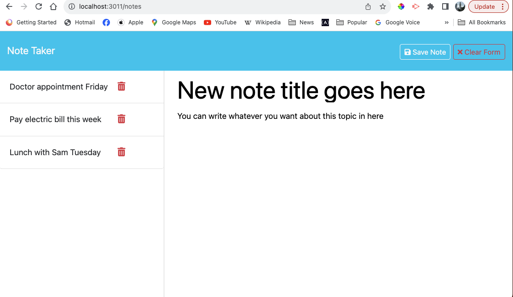

# note-taker
An app that allows the user to create and delete notes that are stored in a data base in the cloud

---

## Technology Used 

| Technology Used         | Resource URL           | 
| ------------- |:-------------:| 
| HTML    | [https://developer.mozilla.org/en-US/docs/Web/HTML](https://developer.mozilla.org/en-US/docs/Web/HTML) | 
| CSS     | [https://developer.mozilla.org/en-US/docs/Web/CSS](https://developer.mozilla.org/en-US/docs/Web/CSS)      |
| JavaScript     | [https://developer.mozilla.org/en-US/docs/Web/JavaScript](https://developer.mozilla.org/en-US/docs/Web/JavaScript)      |   
| Git | [https://git-scm.com/](https://git-scm.com/)     |    
| Node.js | [https://nodejs.org/](https://nodejs.org/)     |
| Render Cloud Application | [https://render.com/](https://render.com/)  |
| NPM | [https://www.npmjs.com](https://www.npmjs.com)   |

---

## Badges


---

## Description

[Visit the site deployed on Render Cloud Hosting Service](https://free-note-taker.onrender.com/)

[Visit the Github repository](https://github.com/Jeffreydne/note-taker)

This application alows a user to create and delete notes and store them in the cloud.  

---

## Instalation

This application requires the npm module inquirer. If you do not already have this module installed globally then you will need to type npm install in the command line before running this program. 


---

## Code Example

The four JavaScript examples below show how the notes.html file can be displayed in the browser when the getAndRenderNotes() function is called. This function is called in server.js anytime changes are stored to the notes.html file which is then re-rendered. First the getAndRenderNotes() function calls getNotes() 
```JS
// Gets notes from the db and renders them to the sidebar
const getAndRenderNotes = () => getNotes().then(renderNoteList);
```
Then this function makes a fetch request with the get method to /api/notes
```JS
// from server.js make fetch request to note-taker/api/notes when this url is in address window of browser
const getNotes = () =>
  fetch('/api/notes', {
    method: 'GET',
    headers: {
      'Content-Type': 'application/json'
    }
  });
```
There is a routes folder in which lies the function to handle this request. The following 2 statements in the server.js file cause all requests with "/api" after the base url to be routed to this file 

```JS
// require routes file
const api = require('./routes/index');

// Send all requests that begin with /api to index.js in the routes folder
app.use('/api', api);

```
 In the router file the readFromFile method is imported from a utility file which then will read the db.json file stored in the db folder and parse it so the data can be rendered on the browser window using the notes.html file.

```JS
//require utility file to get and addend onbjects from database, and require fs for router.delete
const { readFromFile, writeToFile,readAndAppend } = require('../helpers/fsUtils');
const fs = require('fs');
// declare note variable
let note;
// GET Route for retrieving notes
router.get('/notes', (req, res) => {
    console.info(`${req.method} request received for notes`);
    readFromFile('./db/db.json').then((data) => res.json(JSON.parse(data)));
  });
```
## Usage

This website is designed to allow a user to create a note with a headline and a body. With the click of a button that information can be stored in the cloud allowing for easy retireval to help the user remember important information. Just as easily the note can be deleted when no longer needed.



---

## Learning Points

The front end of this website was provided as starter code. I developed the backend functionality to allow the site to be deployed to render.com where it is now accessable to users. 

* The npm fs.writeFile and fs.readFile are used in utility functions that were provided by the bootcamp. These functions allow the needed functionality for the post and delete requests. 

*  Fetch requests are made using the get, post and delete methods to provide functionlity

*  A routes folder was used so that individual api routes were handled in this folder while public folder routes were handled in server.js 

* the uuid functionality of npm was used to generate ids for each note that in turn allows them to be uniquely  identified when deletion of that note is requested by the user.

*  query params were used to obtain the specific id of a note so that note could be deleted using the delete request

*  Render Cloud Hosting is used to host this full stack project.  

---

## Author Info

### Jeffrey Nelson


* [Portfolio](https://jeffreydne.github.io/Jeff-Nelson-Portfolio/)
* [LinkedIn](https://www.linkedin.com/in/jeffrey-nelson13/)
* [Github](https://github.com/Jeffreydne)

---
## Credits

 The excellent staff at UC Berkeley Extension Full Stack Bootcamp provided the basic file structure with db & public folders as well as a package.json file. Also provided was a db.json file (inside db folder) to serve as the data base location. The entire front end html, css and javascript were provided in the public folder. The fsUtils.js file in helpers is taken directly from UC coding camp unit 11 on express; specifically from activity 22, solved file. I also borrowed heavily from the unit 11 activities at the UC Berkeley code camp, in order to implement the code & make the back end function. Finally, I copied open source badges from Vedant Chainani at the website https://dev.to/envoy_/150-badges-for-github-pnk#contents 
 
---

## License

MIT License

---